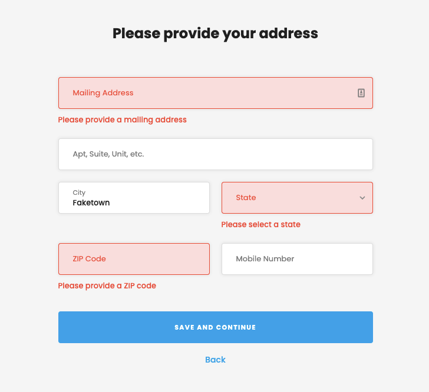

# Welcome!

Hi and welcome to the frontend take-home test! It was built using [`create-react-app`](https://github.com/facebook/create-react-app) on Node v14.18.1. We recommend using [`nvm`](https://github.com/nvm-sh/nvm) to install multiple copies of Node. There are some instructions below to get the build running.

# The Actual Assignment

As for the assessment itself

1. We would like you to create a form that submits data. (The actual submit can be a console.log() output for now.)

2. The form needs to validate the inputs before submitting.

- Included in the project is a great library called [`react-hook-form`](https://react-hook-form.com/). That should help with setting up the form state & validation.

3. The form should match this layout design:

- 

4. Please use the [`styled-components`](https://styled-components.com/) approach to build out the components and CSS. It's included in the build with a starter Button component.

- Use your best judgment in terms of styling. It doesn't have to be 100% exact, but it should be relatively close.

5. (OPTIONAL) As an added bonus, setup a fake API call that submits the address data. Use an endpoint like `https://jsonplaceholder.typicode.com/posts` to `POST` the data. You should receive the same data back that you send.

- We included Axios and React-Query as libraries to use for API handling.

# Testing (optional)

All of the existing tests should be passing. Please add more tests for new components and features. They don't have to be too exhaustive, just test that components render as expected.

---

---

## CRA - Getting Started Scripts

In the project directory, you can run:

### `yarn start`

Runs the app in the development mode.\
Open [http://localhost:3000](http://localhost:3000) to view it in the browser.

The page will reload if you make edits.\
You will also see any lint errors in the console.

### `yarn test`

Launches the test runner in the interactive watch mode.\
See the section about [running tests](https://facebook.github.io/create-react-app/docs/running-tests) for more information.

### `yarn build`

Builds the app for production to the `build` folder.\
It correctly bundles React in production mode and optimizes the build for the best performance.

The build is minified and the filenames include the hashes.\
Your app is ready to be deployed!

## CRA - Learn More

You can learn more in the [Create React App documentation](https://facebook.github.io/create-react-app/docs/getting-started).

To learn React, check out the [React documentation](https://reactjs.org/).
